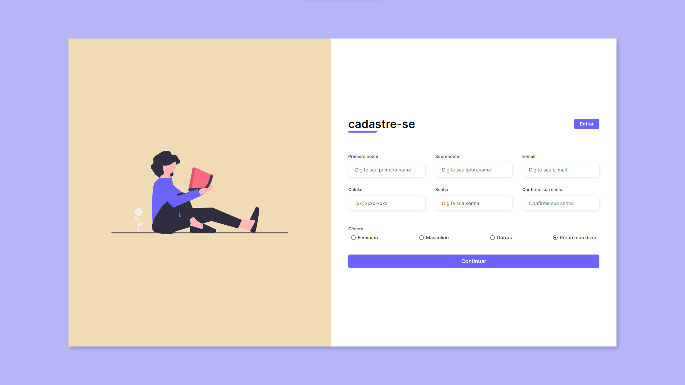

# Formulario Responsivo

Treinando formulários responsivos com HTML e CSS, feito com o auxílio de um tutorial. Para visualizar, [clique aqui!](https://letzc.github.io/formulario-reponsivo/)

## 🛠️ Tecnologias usadas:
- 
- 
